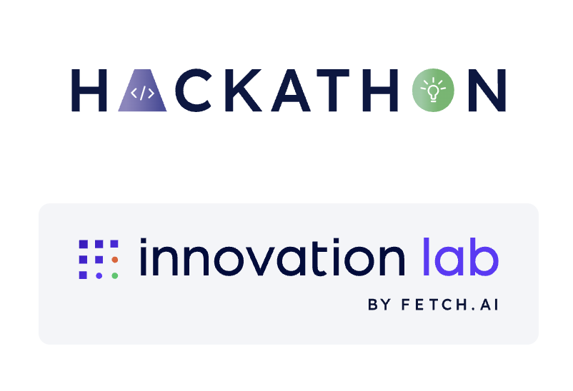

# 🏥 UrgentLA

<p align="center">
  
</p>

> AI-powered urgent care routing — match your symptoms to the right clinic, right now.

UrgentLA is a multi-agent AI system that helps patients find the best urgent care clinic for their symptoms. An AI intake agent collects symptoms through natural conversation, maps them to a medical specialty, and ranks nearby clinics by specialist availability, estimated wait time, and distance.

**⚠️ Disclaimer:** UrgentLA is not a diagnostic tool. It never tells you what is wrong with you. It only helps you choose a clinic. Always follow the advice of a licensed medical professional. In an emergency, call 911.

---

## Fetch.ai
- ASI:One Shared Chat URL: https://asi1.ai/shared-chat/a9d9afdb-16e5-4ef3-bac9-38eb1b61b57a
- Urgentcare Matcher: https://agentverse.ai/agents/details/agent1qv3pnwzylmx4vmw4ytyxecx2gdzn5nfd4au7x4fracn7w2zxp89jgjtrl8d/profile
- Urgentcare Matcher Assistant: https://agentverse.ai/agents/details/agent1q2sgp8g5z35hp73h3r8mwte6qpjf0t6mupwrxyhdnupves8urtr9v62vz6f/profile

---

## 🏆 Built For

- **LA Hacks 2026**
- **Track:** Catalyst for Care (Healthcare)
- **Prize Target:** Fetch.ai Agentverse — Search & Discovery of Agents

---

## ✨ Features

### 🤖 AI Symptom Intake
- AI powered chat collects symptoms conversationally — one question at a time
- Extracts structured output: `{ specialty, urgency (1–10), redFlag }`
- Empathetic tone — never diagnostic, never alarming
- Quick-tap chips: **"Shortest time to doctor"**, **"Fracture care"**, **"Pediatrics"**

### 🚨 Red Flag Detection
- Checked on every reply, not just the final one
- Triggers on: chest pain, difficulty breathing, stroke signs, severe head injury, uncontrolled bleeding, suicidal ideation, severe allergic reaction
- Shows a full-screen red takeover screen with a tap-to-call **"Call 911"** button

### 🎙️ Voice Input
- Speak your symptoms hands-free via the browser's Web Speech API
- Mic button pulses red while recording; transcript appends to existing text
- Works in Chrome (Safari/Firefox do not support Web Speech API)

### 📍 Real Clinic Data
- Finds real urgent care clinics and hospitals near you via **Google Places API (New)**
- Real data: name, address, coordinates, open now, today's hours, rating, review count, Google Maps link
- Estimated data (no public API exists): wait time derived from a time-of-day busyness curve and labeled accordingly
- Falls back to 10 hardcoded LA-area clinics when no API key is present

### 🧮 Matching Algorithm
- Scores clinics against the requested specialty
- Distance calculated using haversine formula
- Distance filter: clinics beyond **15 miles** are excluded
- Returns top 5 clinics sorted by match score

### 🗺️ Map + List View
- Side-by-side chat panel and interactive **Leaflet map** on desktop
- Color-coded map pins by wait time: green ≤15 min · orange 15–30 min · red >30 min
- Hover a clinic card to highlight its pin on the map
- **"Open now"** toggle filters the list in real time

### 🏥 Clinic Cards
- Ranked with numbered badges
- Animated wait-time badge (pulsing dot — green/orange/red)
- AI match score bar (0–100)
- Today's hours + open/closed badge
- Specialization tags
- Tap phone number to call · **"Get directions →"** opens Google Maps

### 🤖 Fetch.ai Multi-Agent Architecture
- **Intake Agent** + **Matcher Agent** registered on Fetch.ai Agentverse
- Discoverable and demoable via ASI:One
- Chat Protocol implemented

---

## 🏗️ How It Works

```
User (web app or ASI:One)
      │
      ▼
┌──────────────────────────┐
│      Intake Agent         │  ← Python · Fetch.ai Agentverse
│  (ASI1 asi1-mini)         │     Accepts text / voice / photo
│                           │     Outputs: specialty, urgency, redFlag
└────────┬─────────────────┘
         │
         ▼
┌──────────────────────────┐
│      Matcher Agent        │  ← Python · Fetch.ai Agentverse
│  (Scoring + Ranking)      │     Google Places API → real clinics
│                           │     Returns: ranked clinics + match %
└──────────────────────────┘
         │
         ▼
  Next.js Web App
  (Chat · Map · Clinic list)
```

---

## 📐 Matching Formula

```
score = (specialtyMatch × 0.4) + (proximityScore × 0.3) + (waitScore × 0.3)

specialtyMatch  = 1.0  if the clinic's specialties include the requested specialty
                  0.0  otherwise

proximityScore  = 1.0 − (distance / 15 miles)   (clamped [0, 1]; closer is better)

waitScore       = 1.0 − (etaMinutes / 90)        (clamped [0, 1]; shorter wait is better)
```

Distance is a **filter**, not a score — clinics beyond 15 miles are excluded entirely.
`matchPercent` displayed in the UI is `score × 100`.

### Specialty Categories

| Specialty | Example Symptoms |
|---|---|
| `general` | cold, fever, fatigue, mild illness |
| `orthopedic` | sprains, fractures, joint pain, back injury |
| `respiratory` | cough, asthma, shortness of breath |
| `gastrointestinal` | stomach pain, nausea, vomiting, diarrhea |
| `dermatology` | rashes, skin infections, allergic reactions |
| `pediatric` | any complaint where patient is a child |

---

## 🛠️ Tech Stack

| Layer | Choice |
|---|---|
| Frontend | Next.js (App Router) + Tailwind CSS + TypeScript |
| AI | ASI1 `asi1-mini` via ASI:One API (chat + vision) |
| Agents | Fetch.ai uAgents (Python) |
| Clinic Data | Google Places API (New) |
| Maps | Leaflet + OpenStreetMap |
| Voice Input | Web Speech API (browser-native) |
| Location | Browser `navigator.geolocation` |
| Agent Registry | Fetch.ai Agentverse |
| Demo Interface | ASI:One |

---

## 📁 File Structure

```
urgentMatch/
├── README.md
├── requirements.txt
├── .env.example
├── assets/
│   └── badges.png
├── agents/
│   ├── intake_agent.py          # ASI1-powered intake via HTTP + Agentverse
│   └── matcher_agent.py         # Clinic scoring and ranking
├── lib/
│   ├── matcher.py               # Scoring formula (Python agent path)
│   ├── distance.py              # Haversine distance calculation
│   ├── specialty.py             # Keyword → specialty mapping
│   ├── places.py                # Google Places API wrapper
│   ├── wait_time.py             # Time-of-day busyness estimation
│   ├── models.py                # Shared data models
│   └── chat_protocol.py        # Fetch.ai Chat Protocol implementation
├── data/
│   └── clinics.py               # Fallback LA-area clinic data
└── web/
    ├── app/
    │   ├── page.tsx             # Home — renders full app (chat + map + list)
    │   ├── layout.tsx
    │   ├── CareApp.tsx          # Root client component (state, routing)
    │   ├── chat/page.tsx        # Mobile chat UI (voice + photo + geolocation)
    │   ├── results/page.tsx     # Results-only view with urgency bar
    │   ├── emergency/page.tsx   # Full-screen 911 takeover
    │   └── api/
    │       ├── chat/route.ts    # Proxies to Python intake agent
    │       ├── match/route.ts   # Match API
    │       └── clinics/route.ts # Google Places query + scoring
    └── urgent-care-finder/
        ├── ResultsView.tsx      # Main component: chat + map + clinic list
        ├── LeafletMap.tsx       # Leaflet map with color-coded pins
        └── ClinicCard.tsx       # Clinic card with match bar + wait badge
```

---

## 🚀 Setup & Running

### 1. Install dependencies

```bash
pip install -r requirements.txt
cd web && npm install
```

### 2. Set up environment variables

```bash
cp .env.example .env.local
```

Fill in:

```env
ASI1_API_KEY=...               # From asi1.ai — powers the intake agent LLM
GOOGLE_PLACES_API_KEY=...      # Enable Places API (New) in Google Cloud Console
AGENTVERSE_API_KEY=...         # From agentverse.ai
MATCHER_AGENT_ADDRESS=...      # Fetch.ai address of the matcher agent
```

> No `GOOGLE_PLACES_API_KEY`? The app falls back to 10 hardcoded LA-area clinics automatically.

### 3. Run the Python intake agent

```bash
python agents/intake_agent.py
# Starts HTTP server on http://localhost:8000
```

### 4. Run the web app

```bash
cd web && npm run dev
# Open http://localhost:3000
```

### 5. (Optional) Run the matcher agent on Agentverse

```bash
python agents/matcher_agent.py
```

### 6. Demo via ASI:One

1. Go to [asi1.ai](https://asi1.ai)
2. Search for **UrgentLA**
3. Describe your symptoms and chat directly with the intake agent

---

## 🧪 Demo Scenarios

| Input | Expected Behavior |
|---|---|
| "I have crushing chest pain and my left arm is numb" | 🚨 Full-screen 911 takeover |
| "I twisted my ankle, it's really swollen, 7/10 pain" | Orthopedic routing · top clinic has ortho match |
| "My 4-year-old has a 103 fever and won't stop crying" | Pediatric routing |
| "I have a rash on my arm that's been itchy for a week" | Dermatology routing · green urgency bar |
| "I've had a fever and trouble breathing for 3 days" | Respiratory routing · moderate urgency |
| Tap **"Fracture care"** chip | Instant orthopedic routing without typing |
| Speak via mic: "My back is killing me" | Voice transcribed and processed identically to text |
| Location denied | Falls back to central LA (34.0522, -118.2437) silently |

---

## 📊 Data Accuracy

| Data | Source | Real or Estimated |
|---|---|---|
| Clinic name, address, coordinates | Google Places API (New) | ✅ Real |
| Open now | Google Places API (New) | ✅ Real |
| Today's hours | Google Places API (New) | ✅ Real |
| Rating + review count | Google Places API (New) | ✅ Real |
| Wait time | Time-of-day busyness curve | 🔄 Estimated |

---

## 🔐 Security

- `ASI1_API_KEY` — server-side only (Python intake agent), never sent to the browser
- `GOOGLE_PLACES_API_KEY` — server-side only
- `AGENTVERSE_API_KEY` — server-side only
- `.env` / `.env.local` are in `.gitignore`

---

## ⚠️ Hackathon Disclaimer

Built at LA Hacks 2026. **Not production-ready:**

- Wait time is estimated — no real clinic system integration
- No HIPAA compliance — do not use with real patient data
- Proof of concept only

---

## 👥 Team

Built with ❤️ by Isabella Li, Connor Mao, Chutitad Singkarin, Michelle Zhu at LA Hacks 2026
